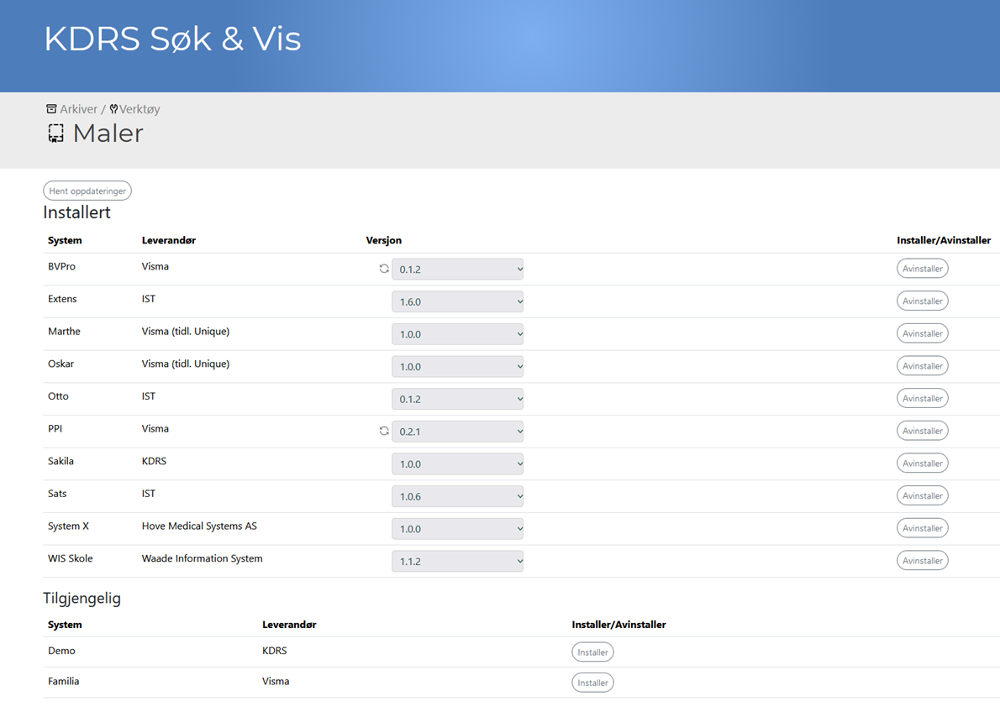
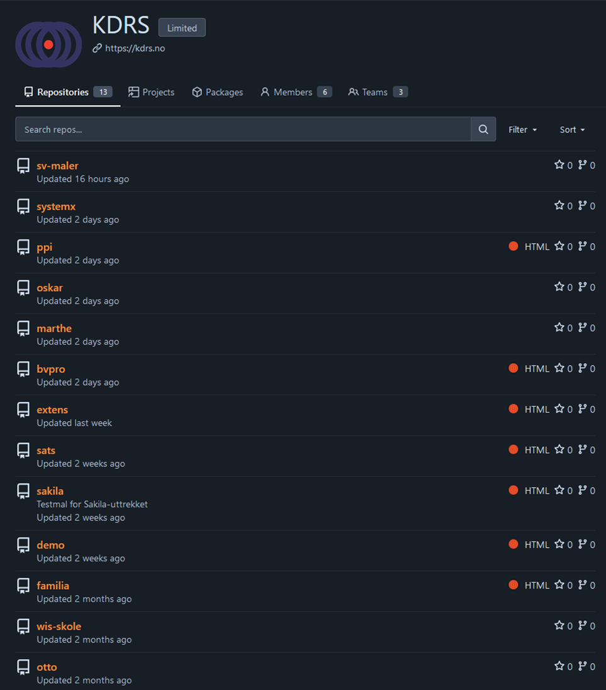
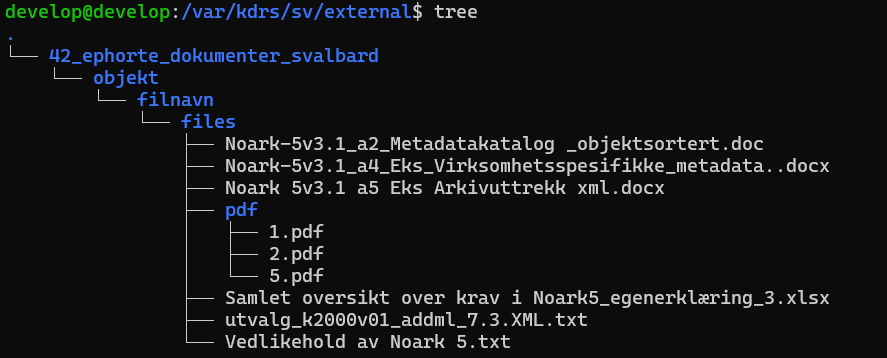
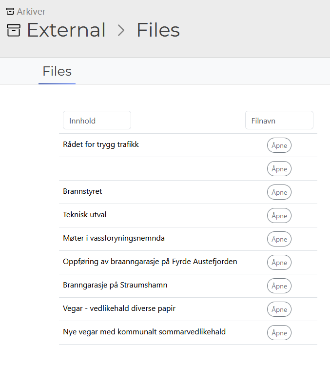
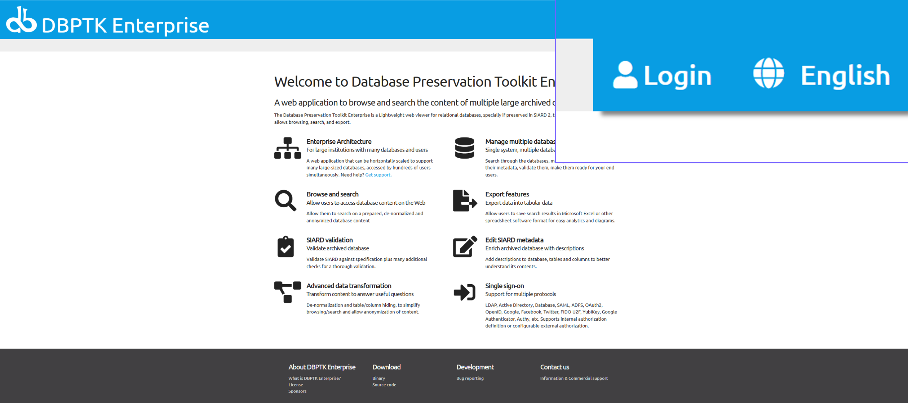
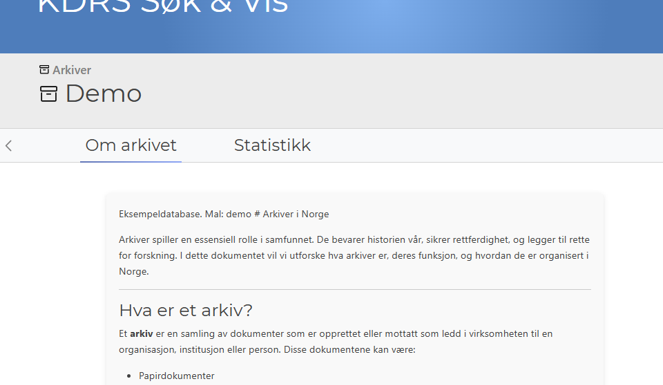
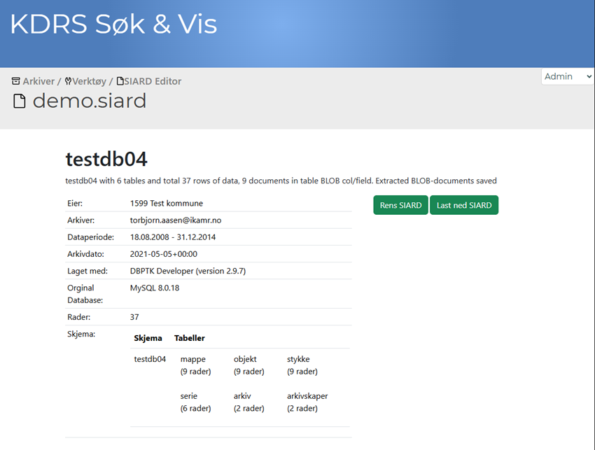
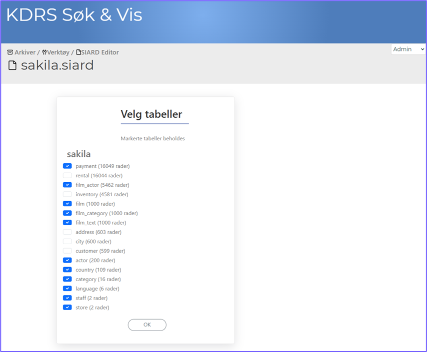
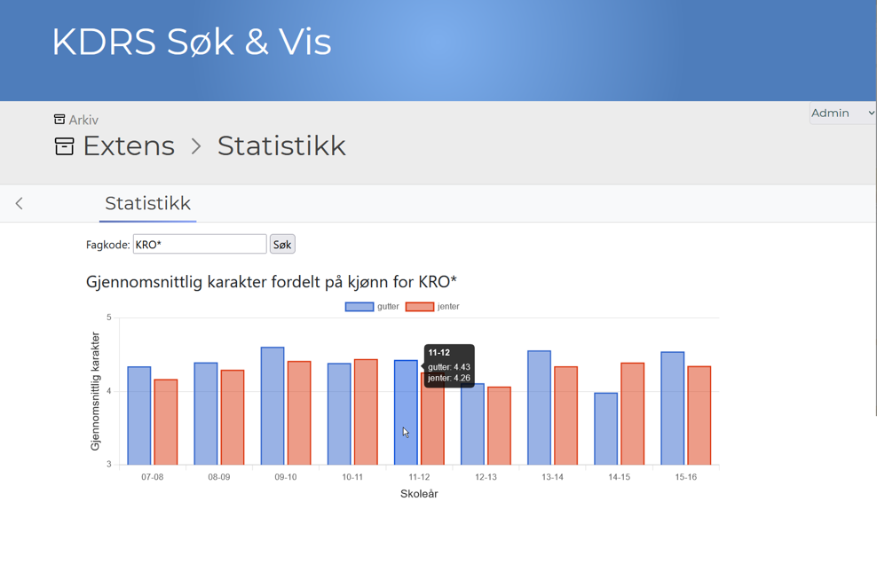

This page contains some highlights for KDRS Search & View 1.6.0. \
A full list of changes can be found [here]({{ 'assets/release/release_1.6.0.html' | relative_url }})
{: .fs-6 .fw-300 }

# Table of Contents
{: .no_toc .text-delta }

1. TOC
{:toc}

# Template manager

We have added a template manager that lets you update, install and download new templates. You can find it by selecting "Tools" in the navigation menu and opening "Templates".

# Template git

To simplify sharing of templates, we have created a git server at [maler.kdrs.no](https://maler.kdrs.no), where templates can be uploaded and collaborated on. All templates here will be directly downloadable from the template manager in KDRS Search & View.

# External files

To better support systems with files that are not part of the database, and therefore not part of the SIARD, we now support external files. This allows you do download regular files on the disk from KDRS Search & View. A guide on how to do this can be found [here]({{ 'guide/external-files/' | relative_url }})

Files on disk:

Downloadable in S&V:

# DBPTK login

To make the installation of S&V easier, DBPTK now comes configured with authentication out of the box. Archivers and admins can login with their KDRS Search & View account.

# Archive comment

In the description of archives, you can now use [markdown](https://www.markdownguide.org/basic-syntax/) to write a better structured description for your archives.

# SIARD edit

In the tools menu, you can find the new SIARD editor which allows for analyzing SIARD files and deleting unnecessary tables.

  
  

# Multi-language support

We have added support for English and Swedish in S&V. Language can be selected in the top right corner. The work done also makes it easier to add new languages in the future.

# Date search

Searching for dates now supports a wide variety of formats, and supports searching for date ranges. Some examples of this can be found [here]({{ 'guide/user-guide/#date-search' | relative_url }})

# Statistics
Support for graphs

# More
{: .no_toc}
A full list of changes can be found [here]({{ 'assets/release/release_1.6.0.html' | relative_url }})
