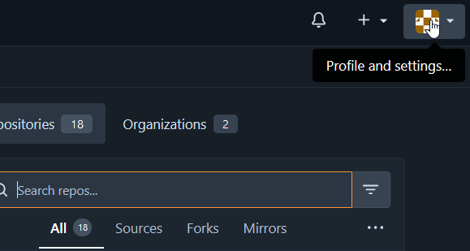
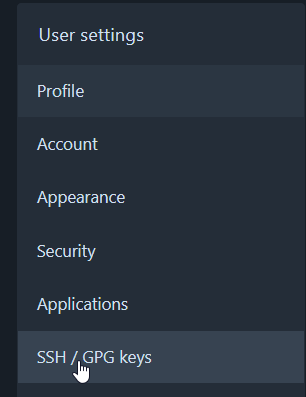
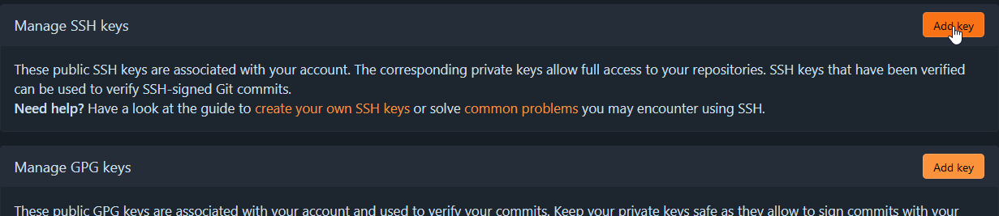

# Setting up authentication

When working with Git, authentication is typically done through SSH. This means you need a pair of SSH keys (public and private). The public key is to give to any service you want to authenticate to (e.g. GitHub) and the private key stays on your computer and is used by your SSH program to prove that you are the owner of the corresponding public key.

If you already have a SSH key, you can skip to "Adding your public key to GitHub"

## Creating SSH keys

To generate the SSH key pair we can use the tool ssh-keygen from OpenSSH.

Use the following command, replacing the email with the address you use for your GitHub account (if you have one).

`ssh-keygen -t ed25519 -C "your_email@example.com"`

This dialog should show up:

Press enter to save the key at the default path.

You will now be asked to enter a passphrase that you will need to use your private key.

Your SSH key pair will now be generated: 

Your key pair will be stored at the following paths:

Windows: `C:\Users\<username>\.ssh\`

Unix: `/home/<username>/.ssh/`

The file `id_ed25519` is your private key, and should stay on your local machine(s) and never be shared with anyone.

The file `id_ed25519.pub` is your public key, and should be shared with services you want to authenticate with.

## Adding your public key to GitHub

1. Log in to GitHub.com and click your profile picture in the top right corner
 

2. Click settings
 

3. Click SSH and GPG keys
 

4. Click new SSH key
 

5. Enter a title of your choice. Open your SSH public key (id_ed25519.pub) in a text editor and copy it's contents to the "key" field.
 

6. Click "Add SSH key".

You are now able to authenticate with GitHub over SSH.

## Adding your private key to another machine

If you need to connect to GitHub from a different machine, or a virtual machine, you need to transfer your SSH private key to that machine. Copy your `id_ed25519` to the following directory:

Windows: `C:\Users\<username>\.ssh\`

Unix: `/home/<username>/.ssh/`

On Unix the SSH private key needs to not be readable by other users. This can be done with the following command:

`chmod 600 ~/.ssh/id_ed25519` 

# Cloning a template

To clone (download) a template from GitHub, open VS Code on the machine you want to edit templates on, or connect remotely. A guide for this can be found [here](/guide/part-0-editing-environment/).

Open the folder `/var/kdrs/sv/templates`

Go to GitHub and open the repository you want to clone.

Click the green "Code" button, and click the copy button in the SSH tab.

In VS Code, click View -> Terminal

This will open a terminal at the bottom. Here we can clone the repository with the command:

`git clone <copied-repository-ssh-url>` 

That's it! Your repository should now be visible in the explorer. You can make commits and push in the "Source Control" tab:

