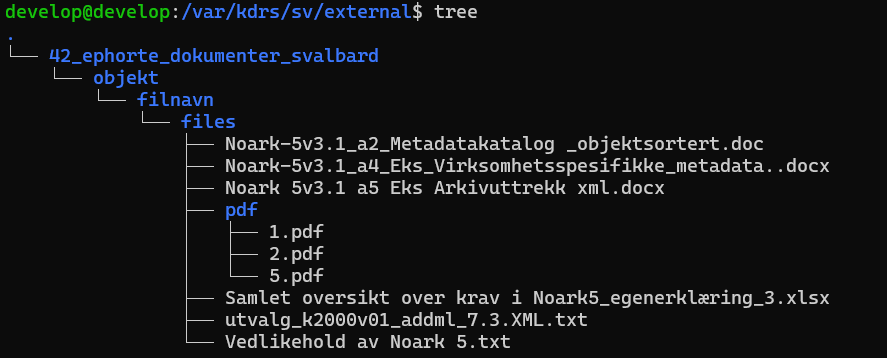

# External files

This guide will teach how to use Search & View to access external files, meaning files that are not part of a SIARD. Many systems reference files stored outside a database through paths, and they can be made available by placing them in the `external` folder.

## When do you need to use external files?

External files can be useful when you have a column referencing file paths, like the following image:

And also the actual files:

## How to use external files

To use the external files, you need to have set up a template displaying the paths like this:

You also need three pieces of information to connect the files to the archive:

1. The catalog ID, found in the URL:
  

The ID is the part after "catalogs/", so in this case the ID is `42`.

{: style="counter-reset: step-counter 1;" }
2. The name of the table. This is the name of the table in the database, which can be found in the template:
   

<table>
    <name>objekt</name> <!-- Name of table  -->
    <title>Files</title>
    <fields>innhold, filnavn</fields>
    <primarykey>innhold</primarykey>
</table>


In our case this name is `objekt`.

{: style="counter-reset: step-counter 2;" }
3. The name of the field containing the path. For our case this is `filnavn`.

These three pieces are used to create the path where we will put our files, relative to the `external` folder at `/var/kdrs/sv`

This means the directory containing our files will be `/var/kdrs/sv/external/42/objekt/filnavn`

After the catalog ID `42`, you can add a comment after an underscore to better organize files. Therefore our path can be:
`42_ephorte_dokumenter_svalbard/objekt/filnavn`

Create the directory:

Add the files to the directory:

*SCP is used in here, but feel free to use any method like FTP or a graphical SCP client*

Opening the table in S&V, you will notice that the paths have disappeared, as S&V is detecting that this column is now used for files, and will try to resolve the paths. This fails, and by hovering the mouse over the empty field, you can see it is trying to resolve the path using the original Windows path like this:

As seen, the contents of the `filnavn` field is appended to the folder we created.

Because our directory structure looks like this:

We have to edit the `filnavn` field such that a path like:

`external/42_ephorte_dokumenter_svalbard/objekt/filnavn/C:\data\ephorte\dokumenter\Vedlikehold av Noark 5.txt`

becomes:

`external/42_ephorte_dokumenter_svalbard/objekt/filnavn/files/Vedlikehold av Noark 5.txt`

We can achieve this by using the [`<edit>`]({{'xml/edit' | relative_url }}) tag to modify the path like this:


<table>
    <name>objekt</name>
    <fields>innhold, filnavn</fields>
    <primarykey>innhold</primarykey>
    <title>Files</title>
    <edit>filnavn.sub("C:\\data\\ephorte\\dokumenter\\", "files/")</edit> <!-- Replace windows path with "files/" -->
    <edit>filnavn.gsub("\\", "/")</edit> <!-- Replace all backslashes with forwardslashes -->
</table>


We first replace `C:\data\ephorte\dokumenter\` with `files` using the [sub](https://apidock.com/ruby/String/sub) method, then we replace every `\` with `/` with [gsub](https://apidock.com/ruby/String/gsub), as forward-slashes are used for paths in Linux.

Note that we have to [escape](https://docs.ruby-lang.org/en/2.4.0/syntax/literals_rdoc.html#label-Strings) backslashes that are part of a string by writing `\\` to represent a single `\`

Now all the files will be downloadable! Use the [`<export>`]({{ 'xml/export' | relative_url }}) tag to allow download of multiple files at once!

If a file is not found, the open button will not show. In cases like this you can hover the mouse over the empty cell to see which path it is looking for the file at.