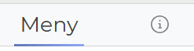

# Styling
How to make your templates look pretty
{: .fs-6 .fw-300 }

# Table of Contents
{: .no_toc .text-delta }

1. TOC
{:toc}

## CSS Styling with Bootstrap
[Bootstrap](https://getbootstrap.com) makes modern css styling available in templates. 
### Example: Formatting a table
{: .no_toc}

  <table class="table">


### Example: Formatting a small table
{: .no_toc}

  <table class="table table-sm">


See [Bootstrap docs](https://getbootstrap.com) for other examples

## Octicons
[Octicons](https://primer.style/foundations/icons) make icons available in templates. These are the same icons that Github uses. \

### Example: Make an archive icon
{: .no_toc}

  <%= octicon("archive") %>  


### Example: Make a larger icon
{: .no_toc}

  <%= octicon("archive", height:30) %>  


### Example: Make the icon gray
{: .no_toc}

  <%= octicon("archive", fill:"gray") %>  


`Note` Bootstrap can also show icons, but so far we like the simplicity of Octicons.

## Charts
With [Chartkick](https://chartkick.com) you can use 1 line of Ruby to draw charts.

## Markdown
You can write your archive description in [Markdown](https://www.markdownguide.org/basic-syntax/)\
`# Heading 1`\
`## Heading 2`\
`### Heading 3`

The user will see a new info icon if the archive description is more than one line\

Its is also possible to render markdown content in a Ruby View
{: .no_toc}

<%= markdown <variable> %>

